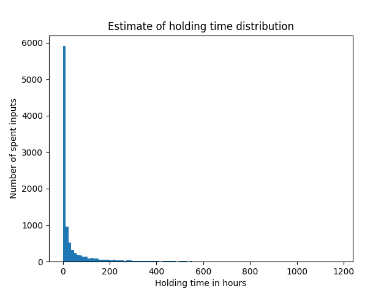
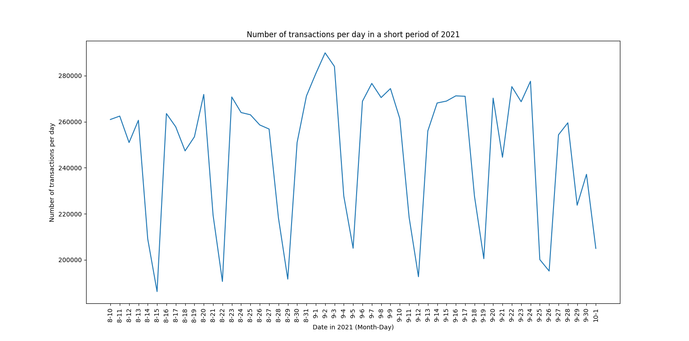
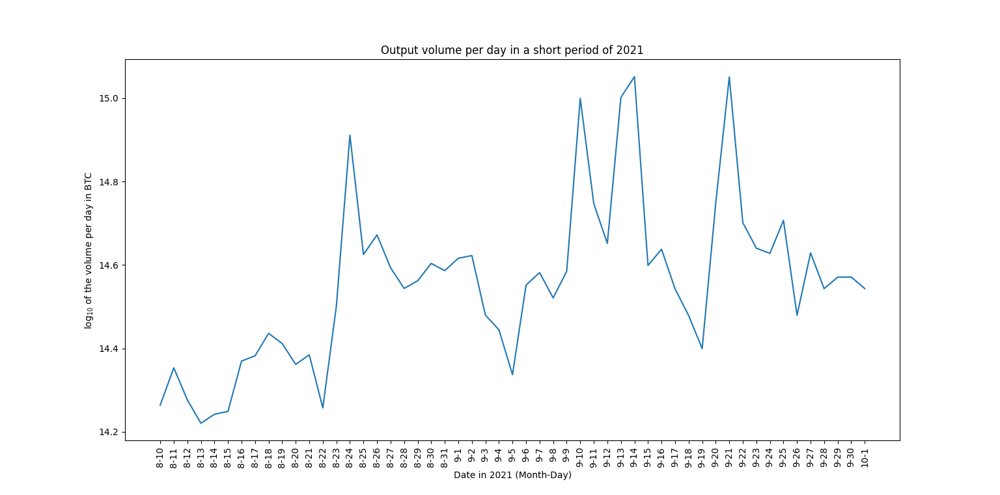

[](http://quantlet.de/)

## [](http://quantlet.de/) **Bitcoin Transaction Analysis** [](http://quantlet.de/)

```yaml

Name of QuantLet: Bitcoin Transaction Analysis

Published in: DEDA WS21

Description: 'Creates a relational database, fills it with bitcoin transaction and does an analysis on them.'
Keywords: bitcoin, database, analysis, holding_time, trading volume

Author: David Schulte

Submitted: March 01 2022 by David Schulte
```





